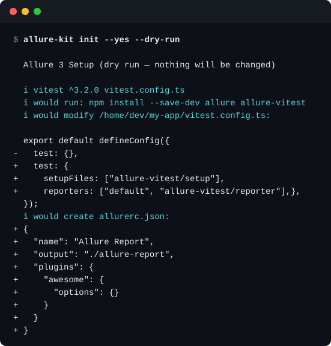
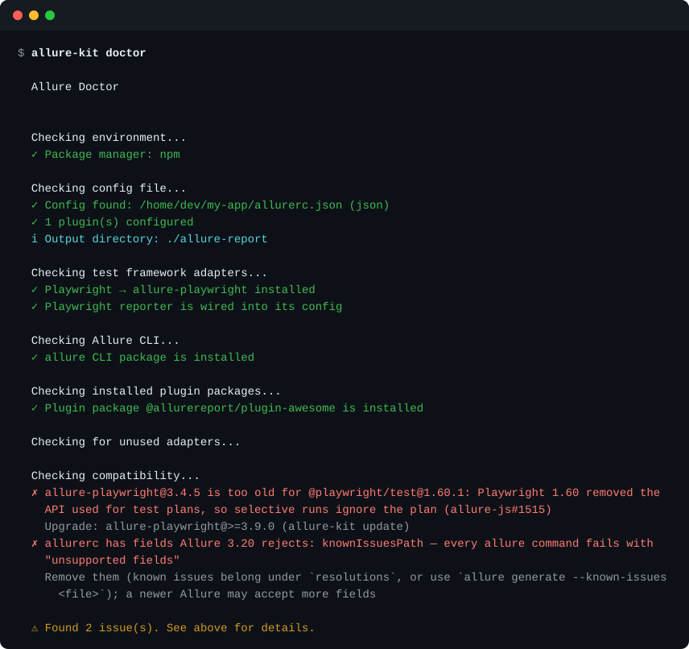
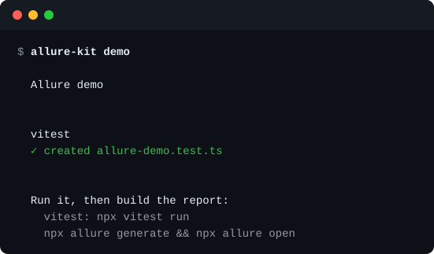
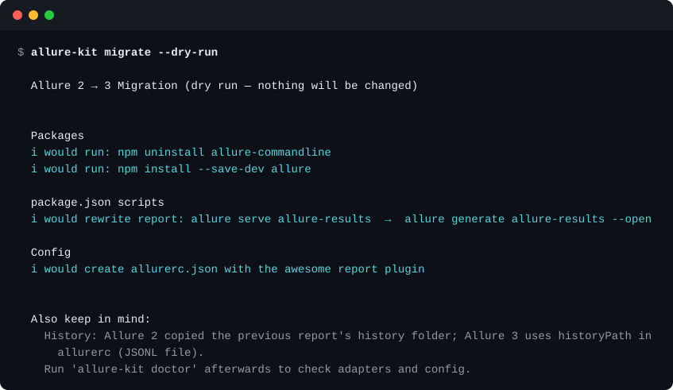
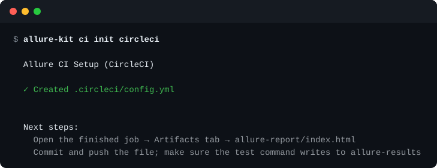
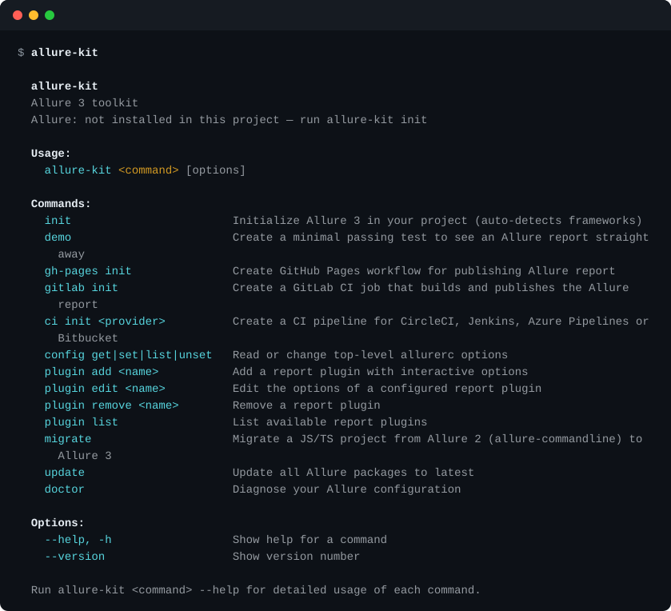

# allure-kit

A standalone CLI that sets up and maintains [Allure Report 3](https://allurereport.org/) in a JavaScript/TypeScript or Python project — the equivalent of `npm init` for Allure.

## Why

[Allure 3](https://github.com/allure-framework/allure3) is a fast, plugin-based reporting engine, but wiring it into a project by hand means a handful of separate steps: figure out which test framework(s) the project uses, install the matching adapter package for each one, hand-write an `allurerc` config, pick and configure report plugins, and — if you want reports published automatically — set up CI and GitHub Pages. It's easy to get one of those steps wrong or out of sync as the project evolves.

`allure-kit` automates all of that:
- detects test frameworks in use and installs the matching Allure adapters,
- for JS/TS frameworks, wires the reporter into the framework's own config (e.g. adds `reporter: [["allure-playwright"]]` to `playwright.config.ts`) so results actually get produced — not just installs the package,
- generates and maintains `allurerc` config files (`json`, `yaml`, or `mjs`),
- manages report plugins (add/remove/list),
- diagnoses a broken or incomplete setup (`doctor`), including whether the reporter is actually wired in, not just installed,
- keeps all installed Allure packages up to date (`update`),
- scaffolds a GitHub Actions workflow that publishes reports to GitHub Pages.

Java (Gradle) projects are supported too: `init --lang java` adds the official `io.qameta.allure` Gradle plugin to `build.gradle(.kts)` (it brings the JUnit 5/TestNG adapter, the AspectJ agent and its own Node.js), `doctor` checks the plugin, the Gradle wrapper version (≥ 8.11) and `autoconfigure`. For Maven, `init` follows the [JUnit 5 guide](https://allurereport.org/docs/junit5/) by inserting text into `pom.xml` (nothing else is rewritten): `allure.version`/`aspectj.version` properties, the `allure-bom` import, `allure-jupiter` (test scope), `maven-surefire-plugin` with the AspectJ `-javaagent` argLine, and `src/test/resources/allure.properties` with `allure.results.directory=target/allure-results`. It backs off with a reason when the pom already has a surefire plugin, an `argLine` or a JaCoCo agent (those have to be merged by hand). `doctor` checks the result (BOM/dependency, the agent, `allure.properties`, and the removed `allure-junit5` artifact).

Detected frameworks: Vitest, Playwright, Jest, Mocha, Cypress, Cucumber.js, Jasmine, CodeceptJS, Newman (Postman), and WebdriverIO (WDIO) for JS/TS; Behave, pytest, Pytest-BDD, and Robot Framework for Python.

## What it looks like

Real output, captured from the built CLI (`npm run screenshots` regenerates these).

**See what `init` would do before it touches anything** — the diff of the framework config, the install command and the `allurerc` it would create:



**`doctor`** finds the setups that fail silently — here an adapter too old for Playwright 1.60 and an `allurerc` field Allure rejects:



**`demo`** writes a minimal passing test so a fresh setup produces a report straight away:



**`migrate`** moves an Allure 2 project (`allure-commandline`, `allure serve`) to Allure 3:



**`ci init`** scaffolds a pipeline that still builds and keeps the report when tests fail:



**All commands:**



## allure-kit vs doing it by hand

Setting Allure up manually is a handful of small steps, each with a way to go wrong *silently* — the tests run, the report is empty. These are the traps found by running the setup on real projects (the repository's end-to-end suite does exactly that, nightly):

| By hand | What goes wrong | allure-kit |
|---|---|---|
| Pick the adapter package for your framework | Wrong or missing package; two adapters that clash (`allure-pytest` + `allure-pytest-bdd` both register `--alluredir`, pytest dies at startup) | Detects the framework from dependencies and config files and installs exactly the right adapter |
| Register the reporter in the framework config | Names that look right and don't exist: Mocha takes `allure-mocha` (not `allure-mocha/reporter`), Jest `allure-jest/node`; Jasmine resolves `helpers` relative to `spec_dir`; an ES `import` in a CommonJS `cypress.config.js` is a `SyntaxError` | Patches the config with the verified names and syntax, shows a diff first (`--dry-run`), and says *why* when it backs off |
| Write `allurerc` | Fields Allure rejects make every command fail (`unsupported fields`) | Generates it, edits it only with keys Allure accepts (`config`, `plugin`), and `doctor` flags the rest |
| Versions | `allure-vitest` on Vitest 2 writes no results and no error; `allure-playwright` before 3.9 ignores the test plan on Playwright 1.60 | `doctor` knows the combinations that fail silently; `update` shows what changes before it does it |
| History | History lives in the *awesome* report folder, needs `historyPath`, and has to survive between CI runs | `gh-pages init` / `gitlab init` set it up and cache it |
| CI | Tests that fail abort the job before the report is built; Bitbucket drops artifacts of a failed step | `ci init` / `gh-pages init` / `gitlab init` build and keep the report even when tests fail, then fail the job |
| Results directory | An adapter writing to `build/allure` while `allure generate` reads `allure-results` | `doctor` compares the two |

None of this replaces reading the [Allure docs](https://allurereport.org/docs/); `init` prints the official page for each framework it configures. It just means you start from a setup that has been run end to end instead of one that merely looks right.

## How it works

- **Framework detection** reads `package.json` dependencies (or, for Python, `requirements*.txt`/`pyproject.toml`/`Pipfile`) and looks for known test-framework config files (`playwright.config.ts`, `vitest.config.ts`, `wdio.conf.ts`, `pytest.ini`, `behave.ini`, etc.) to figure out which frameworks are actually in play, then maps each one to its Allure adapter package (e.g. `playwright` → `allure-playwright`, `pytest` → `allure-pytest`).
- **Package manager detection** looks at the lockfile — `package-lock.json`/`pnpm-lock.yaml`/`yarn.lock`/`bun.lock(b)` for JS/TS, or `poetry.lock`/`pdm.lock`/`Pipfile.lock`/`requirements.txt` for Python — to install adapters with the right tool and flags. A project is treated as Python when `--lang=python` is passed or no `package.json` is found but a Python manifest is present.
- **Reporter wiring** (JS/TS only) mechanically patches the framework's own config for Playwright, WDIO, Jest, Vitest, Mocha, Cucumber.js, CodeceptJS, Cypress, and Jasmine — matching each adapter's documented setup exactly. It backs off and prints a manual hint instead of guessing when the config is in a shape it doesn't recognize (e.g. an existing `reporter` value that isn't an array), rather than risk silently shadowing your config.
- **Config generation** writes an `allurerc` file (JSON/YAML/ESM) wiring up the selected report plugins, defaulting to the [`awesome`](https://allurereport.org/docs/plugin-awesome/) HTML report plugin.
- **`doctor`** re-runs detection and cross-checks it against what's actually installed and configured, flagging missing adapters, unconfigured plugins, or an unused/stale adapter.
- **`update`** finds every `allure*`/`@allurereport/*` package already in `package.json` and bumps it to latest via the detected package manager.
- **`gh-pages init`** writes a `.github/workflows/allure-gh-pages.yml` that runs your tests, generates the report with `allure generate`, and publishes it to the `gh-pages` branch via [`peaceiris/actions-gh-pages`](https://github.com/peaceiris/actions-gh-pages).

Everything is additive and non-destructive: `init` refuses to run if an `allurerc` already exists, and `gh-pages init` asks before overwriting an existing workflow.

## Run

Use without installing:

```bash
npx allure-kit --help
```

## Machine-readable output

For scripts and AI agents: add `--json` to `init`, `demo`, `migrate`, `update`, `ci init`, `gh-pages init`, `gitlab init`, `plugin add` or `plugin remove` and nothing is printed except one JSON document, `{ "command": [...], "ok": true, "messages": [{ "level": "success", "message": "..." }], "error": "..." }` (levels: `success`, `info`, `warning`, `error`, `step`, `hint`, `text`; `error` is set for usage errors; the exit code is unchanged). Run such commands with `--yes` so nothing waits for input. `doctor` has its own `--json` (every check with its step, level, message and hint), and `--strict` for a non-zero exit code.

## Quick Start

```bash
# 1) Initialize Allure in your project
npx allure-kit init

# 2) Run tests so they produce allure-results
npm test

# 3) Build the report
npx allure generate
```

If an `allurerc` file already exists, `init` exits early and points you at `allure-kit doctor` / `allure-kit update` — it never overwrites an existing config.

For a fully non-interactive setup:

```bash
npx allure-kit init --yes
```

For a one-shot install of a specific framework:

```bash
npx allure-kit init --lang=js --framework=playwright
npx allure-kit init --lang=python --framework=pytest
```

Allure 3's report generator (`allure generate`) is a Node.js CLI regardless of the test framework's language, so Python projects still need Node.js available to run `npx allure generate` — `init` only installs the Python-side adapter package(s) via the detected Python package manager, it doesn't add a `package.json` to a pure Python project.

## Commands

### `init`

```bash
allure-kit init [--lang js|ts|python] [--framework <id>] [--format json|yaml|mjs] [--yes] [--dry-run] [--workspaces] [--cwd <path>]
```

Detects test frameworks (by dependencies, config files, and existing tests), installs matching adapters, and creates an `allurerc` config. After wiring, `init` prints the official Allure configuration page for each selected framework (adapter options and examples). `init` does **not** generate any tests — it only configures Allure; run `allure-kit demo` afterwards if you want a minimal passing test to see a report right away.

Flags:
- `--lang` — project language: `js`/`ts` (treated the same) or `python`/`py`. Without this flag, `init` auto-detects: `package.json` present → JS/TS, otherwise a Python manifest (`pyproject.toml`, `requirements*.txt`, `Pipfile`, `setup.py`/`setup.cfg`) present → Python, otherwise defaults to JS/TS.
- `--framework` — force-pick a single framework by id or package name (`playwright`, `vitest`, `wdio`, `pytest`, `behave`, ...). Implies non-interactive mode with the default `awesome` plugin.
- `--format` — `json` (default), `yaml`, or `mjs` config format.
- `--yes` — accept defaults without prompts.
- `--workspaces` — in an npm/yarn/pnpm monorepo, run `init` (with the same flags) in every workspace package that has a test framework, each getting its own `allurerc`.
- `--dry-run` — print the install command, a diff of every framework config it would change, and the `allurerc` it would create, without touching anything.
- `--cwd` — working directory.

### `update`

```bash
allure-kit update [--yes] [--dry-run] [--cwd <path>]
```

Finds every installed Allure package (CLI, adapters, plugins), looks up the latest version of each with `npm view`, and shows `installed → latest` (major upgrades are flagged). Packages that are already current are skipped; the rest are updated to latest via your package manager after confirmation. If the registry can't be reached the package is still updated, as before. `--dry-run` only prints the plan.

### `migrate`

```bash
allure-kit migrate [--dry-run] [--cwd <path>]
```

For JS/TS projects still on Allure 2: replaces `allure-commandline` with `allure`, rewrites `package.json` scripts (`allure serve <dir>` → `allure generate <dir> --open`; `--clean` is dropped because Allure 3's `generate` doesn't accept it), and creates an `allurerc.json` if there is none. `-c` is only flagged for manual review — it meant "clean" in Allure 2 but is `--config` in Allure 3. Use `--dry-run` to preview.

In a Maven or Gradle project (no `package.json`) it migrates `allure-junit5` / `allure-junit5-assert` to `allure-jupiter` / `allure-jupiter-assert` (Allure Java 3.0 no longer publishes the old artifacts) and bumps a shared `<allure.version>` property below 3 to 3.0.0. Versions pinned on a dependency itself are only reported, and Allure Java 3 needs Java 17+.

### `doctor`

In a monorepo, when the root has no test framework, `init` and `doctor` look into npm/yarn/pnpm workspaces and tell you which packages to run them in (`--cwd packages/web`).

```bash
allure-kit doctor [--lang js|ts|python] [--json] [--strict] [--cwd <path>]
```

Checks: package manager detection, `allurerc` presence and validity, adapter packages for each detected framework, the `allure` CLI package, configured plugin packages, and adapters that are installed but no longer match a detected framework.

It also looks for combinations that fail silently: an adapter too old for the installed framework (currently `allure-playwright` < 3.9.0 with Playwright ≥ 1.60, where selective test-plan runs stop working), `allure-js` adapters on a different minor version than `allure-js-commons`, `qualityGate` combined with `historyPath` (known upstream issue [allure3#895](https://github.com/allure-framework/allure3/issues/895)), an `ALLURE_TESTPLAN_PATH` that points to a missing or invalid file, a custom plugin `import` that points to a missing local file, an `allurerc` with fields Allure rejects (the whole CLI then fails with "unsupported fields"), an adapter whose `resultsDir` (or the WebdriverIO reporter's `outputDir`) differs from the directory `allure generate` reads (an empty report without an error), a GitHub workflow using `allure-framework/allure-action` without `pull-requests: write` / `checks: write` permissions or a `github-token` input (the step runs but nothing shows up on the PR), `allure-vitest` ≥ 3.13 on Vitest < 3 (it silently writes no results — reproduced in a clean project), a configured `testops` plugin outside CI (it only uploads when `CI=true`, `ALLURE_TESTOPS_ENABLED=true` or `ALLURE_JOB_RUN_ID` is set; `plugin add testops` says so, and offers `ALLURE_ENDPOINT` / `ALLURE_TOKEN` / `ALLURE_PROJECT_ID` / `ALLURE_LAUNCH_NAME` as the environment alternatives to the options), a GitHub workflow using `allure-framework/allure-action` without `pull-requests: write` / `checks: write` permissions or a `github-token` input (the step runs but nothing shows up on the PR), `allure-vitest` ≥ 3.13 on Vitest < 3 (it silently writes no results — reproduced in a clean project), an `allure` package older than v3 or `allure-commandline` (Allure 2) installed next to it. For TestOps users it hints at `useLegacyFullName: true` for `allure-playwright` (the default `fullName` is `file:line:column` and shifts when a test moves, so test-plan runs drop it). It also lists known adapter limitations for the detected frameworks (no retry marking in Jest/Vitest, no test-plan support in CodeceptJS/Newman, Newman not writing `environmentInfo`/`categories`).

`--json` prints every check (step, level, message, hint) as JSON for CI and scripts; `--strict` makes the command exit with code 1 when issues are found.

### `demo`

```bash
allure-kit demo [--framework <id>] [--lang js|ts|python|java] [--force] [--dry-run] [--cwd <path>]
```

Writes one tiny passing test for each detected framework (or the one given with `--framework`), named so that the framework finds it by default, and prints how to run it and build the report. Existing files are never overwritten without `--force`. Templates exist for Vitest, Jest, Mocha, Playwright, Jasmine, Cucumber.js, pytest, Pytest-BDD, Behave, Robot Framework and JUnit 5 — the same tests the end-to-end suite runs.

### `gh-pages init`

With `--pr-comments` the workflow also runs on pull requests and posts the test summary as a comment and a check via [`allure-framework/allure-action`](https://allurereport.org/docs/integrations-github-action/) (it adds `pull-requests: write` / `checks: write`); pull-request runs are not published to Pages and do not touch the cached history.

Creates a GitHub Actions workflow that generates an Allure report and publishes it to GitHub Pages via the `gh-pages` branch. If the tests fail, the report is still generated and published, and the job fails afterwards. History is kept between runs by caching the `historyPath` file (`init` sets `historyPath: ./history.jsonl` in a JSON/YAML `allurerc` if it's missing; for an ESM config it prints a hint).

```bash
allure-kit gh-pages init [--lang js|ts|python] [--pr-comments] [--yes] [--branch <name>] [--config <path>] [--test-command <cmd>] [--cwd <path>]
```

### `ci init <provider>`

```bash
allure-kit ci init circleci|jenkins|azure|bitbucket [--lang js|ts|python] [--test-command <cmd>] [--yes] [--cwd <path>]
```

Creates `.circleci/config.yml`, a `Jenkinsfile`, `azure-pipelines.yml` or `bitbucket-pipelines.yml` (Bitbucket runs one container image, so it is JS/TS only; the artifact uses `capture-on: always` so the report is kept when a step fails). Every pipeline installs dependencies, runs the tests without aborting, builds the report with `allure generate`, keeps it as a build artifact and fails the job afterwards if the tests failed. Python projects get a Python+Node image/setup and the framework's own test command; Gradle projects get a JDK image, `./gradlew test` and the plugin's `./gradlew allureReport` (report in `build/reports/allure-report/allureReport`). Maven projects get a `cimg/openjdk:17.0-node` image (CircleCI), `mvn -B test` and `npx --yes allure generate target/allure-results` (set `allure.results.directory=target/allure-results` in `allure.properties`). GitHub and GitLab have their own commands (`gh-pages init`, `gitlab init`).

### `gitlab init`

Creates a GitLab CI job (`.gitlab/allure-report.gitlab-ci.yml`, included from `.gitlab-ci.yml`) that runs your tests and calls `allure gitlab`: it builds the report, restores history from the previous run, and posts a summary comment on merge requests. Set a masked `GITLAB_TOKEN` CI/CD variable (api scope) to enable history restore and comments.

```bash
allure-kit gitlab init [--lang js|ts|python] [--yes] [--image <image>] [--config <path>] [--test-command <cmd>] [--cwd <path>]
```

### `config get` / `config set` / `config list` / `config unset`

Read, write, list or remove top-level `allurerc` options (`name`, `output`, `resultsDir`, `historyPath`, `appendHistory`, `historyLimit`, `historyBaseUrl`, `environment`, `port`, `flakyDetection.historyDepth`, `flakyDetection.includePassedTests`, and the structured `qualityGate`, `categories`, `variables`, `defaultLabels`, `hideLabels`, `allowedEnvironments`, `globalAttachments` given as JSON). Works on JSON/YAML configs, and on an `allurerc.mjs` / `.cjs` whose config is a plain object literal (`export default defineConfig({...})`, `export default {...}`, `module.exports = ...`) — those are edited in place as text, so comments and formatting survive. `config get` / `config list` can't evaluate an ESM config and only work for JSON/YAML.

```bash
allure-kit config set flakyDetection.historyDepth 10
allure-kit config get resultsDir
allure-kit config list      # only options that are set
allure-kit config unset flakyDetection.historyDepth
```

### `plugin list`

```bash
allure-kit plugin list [--cwd <path>]
```

### `plugin add`

```bash
allure-kit plugin add <name> [--skip-options] [--cwd <path>]
```

Prompts for confirmation before overwriting a plugin that is already configured.

### `plugin edit`

```bash
allure-kit plugin edit <name> [--cwd <path>]
```

Updates the options of a plugin that is already configured, pre-filled with its current values.

### `plugin remove`

```bash
allure-kit plugin remove <name> [--uninstall] [--cwd <path>]
```

## Supported frameworks

| Framework | Adapter package |
|---|---|
| [Vitest](https://vitest.dev/) | `allure-vitest` |
| [Playwright](https://playwright.dev/) | `allure-playwright` |
| [Jest](https://jestjs.io/) | `allure-jest` |
| [Mocha](https://mochajs.org/) | `allure-mocha` |
| [Cypress](https://www.cypress.io/) | `allure-cypress` |
| [Cucumber.js](https://github.com/cucumber/cucumber-js) | `allure-cucumberjs` |
| [Jasmine](https://jasmine.github.io/) | `allure-jasmine` |
| [CodeceptJS](https://codecept.io/) | `allure-codeceptjs` |
| [Newman](https://github.com/postmanlabs/newman) (Postman) | `newman-reporter-allure` |
| [WebdriverIO](https://webdriver.io/) (WDIO) | `@wdio/allure-reporter` |

Python:

| Framework | Adapter package |
|---|---|
| [Behave](https://behave.readthedocs.io/) | `allure-behave` |
| [pytest](https://pytest.org/) | `allure-pytest` |
| [Pytest-BDD](https://pytest-bdd.readthedocs.io/) | `allure-pytest-bdd` |
| [Robot Framework](https://robotframework.org/) | `allure-robotframework` |

Python package managers pip, [Poetry](https://python-poetry.org/), [PDM](https://pdm-project.org/), and [Pipenv](https://pipenv.pypa.io/) are auto-detected the same way as the npm-family managers. `pip install` doesn't update any manifest on its own, so when pip is the resolved manager `init` also appends the installed adapter(s) to `requirements.txt`.

`doctor` works for Python projects too: it checks that each detected framework's adapter is declared in your dependencies (`requirements*.txt`, `pyproject.toml`, `Pipfile`) and reminds you that reports need the Node.js Allure CLI. `gh-pages init` also scaffolds a Python workflow (`actions/setup-python`, the project's own installer, the framework's `--alluredir`/formatter command, Node for `npx allure generate`); `gitlab init` supports Python too (a `python:3.12` job that installs Node.js from NodeSource for `allure gitlab`).

## Report plugins

All plugins are official [Allure 3 report plugins](https://allurereport.org/docs/). `awesome` is installed by default.

| Plugin | Package | Description |
|---|---|---|
| `awesome` (default) | `@allurereport/plugin-awesome` | Interactive HTML report |
| `classic` | `@allurereport/plugin-classic` | Classic Allure HTML report |
| `dashboard` | `@allurereport/plugin-dashboard` | Summary dashboard |
| `csv` | `@allurereport/plugin-csv` | CSV export |
| `log` | `@allurereport/plugin-log` | Console log output |
| `slack` | `@allurereport/plugin-slack` | Slack notifications |
| `jira` | `@allurereport/plugin-jira` | Jira integration |
| `testops` | `@allurereport/plugin-testops` | Allure TestOps integration |
| `allure2` | `@allurereport/plugin-allure2` | Allure 2 compatible report format |
| `testplan` | `@allurereport/plugin-testplan` | Generates `testplan.json` for selective test execution |
| `progress` | `@allurereport/plugin-progress` | Shows report generation progress in console |

Manage them any time with `allure-kit plugin add|remove|list`.

## Packages

This repo is an npm workspaces monorepo, split for internal organization — only `allure-kit` is published. `packages/core`, `packages/npm`, and `packages/python` are `private` and get bundled directly into `allure-kit`'s `dist/cli.cjs` at build time, so installing `allure-kit` never pulls them in as separate packages.

| Package | What it is |
|---|---|
| [`allure-kit`](packages/cli) | The CLI itself — commands, prompts, `bin/allure-kit.js`. The only package published to npm. |
| [`@todti/allure-kit-core`](packages/core) | Shared kernel: config I/O, exec, fs helpers, the report-plugin registry, and the `EcosystemAdapter` contract |
| [`@todti/allure-kit-npm`](packages/npm) | JS/TS framework detection, npm/yarn/pnpm/bun integration, and reporter-config wiring |
| [`@todti/allure-kit-python`](packages/python) | Python framework detection + pip/poetry/pdm/pipenv integration |

Adding support for another language (e.g. Java) means implementing one more `EcosystemAdapter` package (in `packages/<language>`) against `@todti/allure-kit-core` and registering it as a devDependency of `packages/cli` in `packages/cli/src/ecosystems.ts` — no changes to `init`'s control flow, and no new package to publish.

## Development

```bash
npm install
npm run build      # builds all packages in dependency order (TS project references)
npm test           # runs every package's tests in one vitest run
npm run typecheck
```

## Origin

`allure-kit` started as the `allure kit` subcommand proposed for the [Allure 3](https://github.com/allure-framework/allure3) CLI in [allure-framework/allure3#556](https://github.com/allure-framework/allure3/pull/556). It's extracted here into a self-contained, independently publishable CLI, decoupled from the `allure3` monorepo release cycle so it can ship and iterate on its own.

For the reporting engine itself, adapters, and plugins, see:
- [allure-framework/allure3](https://github.com/allure-framework/allure3) — the Allure 3 monorepo
- [allurereport.org](https://allurereport.org/) — official docs
- [allure-framework/allure3#556](https://github.com/allure-framework/allure3/pull/556) — the original PR this project was extracted from

## License

[Apache-2.0](LICENSE)

## Releasing

See [RELEASING.md](RELEASING.md) (semver policy, tag-triggered publish with npm provenance) and [CHANGELOG.md](CHANGELOG.md).
